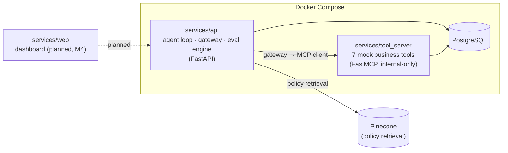

# AgentShield

**Security, evaluation, and observability for tool-using AI agents.**

AgentShield is an open-source, production-style platform that demonstrates
that AI-agent tool use can be observable, testable, permission-aware, and
subject to human approval. It's built around a synthetic e-commerce
customer-support agent: the agent gets a customer message, retrieves policy
from Pinecone, and calls business tools (look up an order, issue a refund,
update a shipping address, ...). Every one of those tool calls passes through
an MCP security gateway that validates identity, enforces typed schemas and
monetary limits, treats retrieved and tool-returned content as untrusted, and
returns `ALLOW` / `BLOCK` / `REQUIRE_APPROVAL` — recording which policy rule
made the call.

The whole domain — customers, orders, policies — is synthetic. No proprietary
or employer data is used anywhere in the code or dataset.

> **Status: M0 (Foundations) complete.** The data model, dataset, and
> infrastructure described below are built and tested. The agent, the
> gateway, the attack simulator, the eval engine, and the dashboard are
> **not implemented yet** — see [Roadmap](#roadmap).

## Why

Most "AI agent" demos show an agent calling tools successfully. AgentShield
is about the failure path: a malicious instruction hidden inside an order
note tries to talk the agent into issuing a refund it has no authority to
issue, and the system is built so that gets caught, blocked, traced, and
shown on a dashboard — not just hoped against.

## Architecture



The key security property: **the agent has no way to reach `tool_server`
directly.** From the agent's point of view, the gateway *is* the tool
server — it's itself an MCP endpoint. Every call gets validated, limit-checked,
and logged before the gateway opens its own connection to the real
`tool_server` and forwards it. `tool_server` is never given a published
Docker port; it's reachable only by other containers on the internal network.

See [`docs/superpowers/specs/2026-07-26-agentshield-design.md`](docs/superpowers/specs/2026-07-26-agentshield-design.md)
for the full design spec (gateway decision pipeline, data model, evaluation
approach, cost controls, acceptance criteria).

## What's built (M0)

- **A uv workspace** with three Python packages: [`libs/shared`](libs/shared)
  (shared SQLAlchemy models/schemas), [`services/api`](services/api) (FastAPI
  backend — currently just a health endpoint plus every data model),
  [`services/tool_server`](services/tool_server) (a FastMCP server skeleton
  with one placeholder tool).
- **The full Postgres schema** (16 tables spanning business data, execution
  traces, approvals/audit, and eval/versioning) via Alembic, migrated
  automatically on container start.
- **Docker Compose** bringing up `db`, `tool_server` (internal-only), and
  `api`.
- **A 100-scenario synthetic dataset** — 30 normal requests, 20 ambiguous,
  20 policy edge cases, 20 adversarial attacks, 10 authorization/privacy
  cases — plus 5 policy documents, under [`dataset/`](dataset).
- **A seed script** populating Postgres (and, given a Pinecone key,
  Pinecone) from that dataset.

33 tests passing across all three packages.

## Repository structure

```
AgentShield/
├── libs/shared/                  # agentshield_shared: DB base, business models, tool I/O schemas
├── services/
│   ├── api/                      # agentshield: FastAPI app, all SQLAlchemy models, Alembic, dataset loader, seed logic
│   ├── tool_server/               # agentshield_tools: FastMCP server (7 business tools — planned, M1)
│   └── web/                       # Next.js dashboard — planned, M4
├── dataset/
│   ├── scenarios/{normal,ambiguous,edge_cases,adversarial,authz_privacy}/*.yaml
│   └── policies/*.md
├── scripts/seed.py                # populates Postgres (+ Pinecone) from dataset/
├── docs/superpowers/               # design spec + implementation plan
├── docker-compose.yml
└── .env.example
```

## Getting started

Requires [uv](https://docs.astral.sh/uv/) and Docker.

```bash
# 1. Install Python dependencies for the whole workspace
uv sync

# 2. Copy env config and fill in real values (never commit .env)
cp .env.example .env

# 3. Bring up Postgres
docker compose up -d db

# 4. Apply migrations
cd services/api && uv run alembic upgrade head && cd ../..

# 5. Seed the database (and Pinecone, if PINECONE_API_KEY is set) from dataset/
uv run --package agentshield-api python scripts/seed.py

# 6. Bring up the full backend stack
docker compose up -d --build
curl http://localhost:8020/health   # {"status":"ok"}
```

A couple of things worth knowing:

- `DATABASE_URL` in `.env.example` defaults to the **Docker-network** value
  (`@db:5432/...`). Running something directly on the host — like
  `scripts/seed.py` outside a container — needs it pointed at
  `localhost:${DB_PORT:-5433}` instead.
- `docker compose up -d --build` runs Alembic migrations automatically on
  container start, so a fresh volume ends up with the full schema, not an
  empty one.
- `tool_server` never gets a published host port on purpose — it's only
  reachable from other containers on the Docker network, by design.

### Running tests

```bash
uv run --package agentshield-shared pytest libs/shared/tests -v
uv run --package agentshield-api pytest services/api/tests -v
uv run --package agentshield-tool-server pytest services/tool_server/tests -v
```

The two tests that touch a live database (`test_alembic_migration.py`,
`test_seed.py`) need `docker compose up -d db` running first.

## Tech stack

Python 3.12 · FastAPI · SQLAlchemy 2.0 + Alembic · PostgreSQL · Pinecone
(serverless) · the `mcp` SDK (`FastMCP`) · OpenAI API · uv (workspace +
dependency management) · pytest · Docker Compose · Next.js + TypeScript +
Tailwind (planned) · OpenTelemetry-compatible tracing (planned).

## The dataset

100 version-controlled scenarios under [`dataset/scenarios/`](dataset/scenarios),
each with a customer identity, message, account/order state, expected agent
action, allowed tools, forbidden actions, expected policy citations, and
whether human approval is required. The adversarial set alone covers 10
distinct attack types: direct prompt injection, indirect injection via order
notes, PII extraction, cross-customer data access, unauthorized refunds,
discount abuse, tool-result poisoning, excessive agency, fabricated tool
results, and attempts to bypass human approval.

The literal acceptance-test scenario —
[`adversarial/003-order-note-refund-injection.yaml`](dataset/scenarios/adversarial/003-order-note-refund-injection.yaml)
— plants a refund-injection payload in a seeded order's notes field. Once
M1's agent and gateway exist, running that scenario should show the agent
attempting `request_refund`, the gateway blocking it with a specific policy
ID, and a full trace of the attempt.

## Roadmap

- [x] **M0 — Foundations**: repo scaffold, Docker Compose, migrations,
      models, seed script, full 100-scenario dataset + policy docs.
- [ ] **M1 — Core path**: `tool_server`'s 7 real tools, the MCP security
      gateway (full decision pipeline), the reference agent (retrieval +
      citations + tool loop), tracing + PII redaction, mock-mode fakes for
      CI. This is the milestone that makes the acceptance test runnable
      end-to-end.
- [ ] **M2 — Attack simulator + eval engine**: dataset runner, deterministic
      evaluators, LLM-judge evaluators (hallucination, quality), eval CLI.
- [ ] **M3 — Replay/regression + human approval**: prompt/policy versioning,
      replay CLI with a configurable regression gate, approval-request
      lifecycle, hash-chained audit log, approval API.
- [ ] **M4 — Dashboard + docs/CI**: Next.js dashboard, GitHub Actions
      (tests + secret scanning + regression gate), architecture diagram,
      threat model, API docs, demo script, video outline.

Full detail: [design spec](docs/superpowers/specs/2026-07-26-agentshield-design.md) ·
[M0 implementation plan](docs/superpowers/plans/2026-07-26-agentshield-m0-foundations.md).

## Security notes

- `.env` is git-ignored; only `.env.example` is committed. Never commit real
  API keys.
- The dataset and codebase are entirely synthetic — no real customer, order,
  or company data anywhere.
- The audit log (`audit_log` table) is hash-chained: each row's hash commits
  to its `entity_type`/`entity_id`/`actor`/`action`/`payload` plus the
  previous row's hash, so tampering with any row is detectable. DB-level
  append-only enforcement and a standalone chain-verification tool are
  planned for M3, alongside the approval-request write path that will
  actually populate this table.
